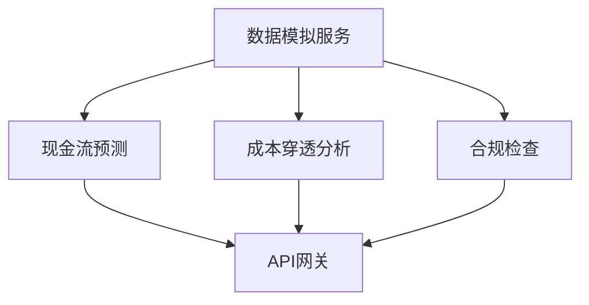

# 商户智能分析平台 - 服务集成规范

本文档描述了商户智能分析平台各微服务间的集成规范，包括服务通信协议、数据格式标准和错误代码规范。

## 服务依赖图谱



## 服务通信协议

系统采用以下通信协议进行服务间通信：

### REST API

- **使用场景**：外部API接口、简单内部服务调用
- **请求格式**：标准HTTP请求，JSON请求体
- **认证方式**：JWT Bearer令牌
- **基础URL格式**：`https://{service-name}.api.merchant-analytics.com/v1/`
- **版本控制**：URL路径版本号

### gRPC

- **使用场景**：高频内部服务通信，性能敏感场景
- **消息格式**：Protocol Buffers
- **服务发现**：基于Consul的服务注册与发现
- **负载均衡**：客户端负载均衡
- **传输安全**：mTLS（相互TLS认证）

## 数据格式标准

### REST API JSON格式

所有REST API响应遵循以下统一格式：

```json
{
  "request_id": "req_yyyyMMddHHmmss",
  "status": "success|error",
  "data": {
    // 业务数据...
  },
  "error": {
    "code": "ERROR_CODE",
    "message": "错误描述",
    "details": {}
  }
}
```

### Protocol Buffers（用于gRPC通信）

所有服务间通信使用的Protocol Buffers定义存放在`/protos`目录下，遵循以下命名规范：

- 服务定义文件: `{service_name}_service.proto`
- 数据模型文件: `{service_name}_models.proto`
- 共享模型文件: `common_models.proto`

示例Proto定义：

```protobuf
syntax = "proto3";

package merchant.analytics.cashflow;

import "common_models.proto";

service CashflowPredictionService {
  rpc PredictCashflow (PredictionRequest) returns (PredictionResponse);
}

message PredictionRequest {
  string merchant_id = 1;
  common.TimeRange time_range = 2;
  PredictionParameters parameters = 3;
}

message PredictionResponse {
  string request_id = 1;
  repeated CashflowPoint predictions = 2;
  PredictionMetrics metrics = 3;
}

// 其他消息定义...
```

## 错误代码规范

系统使用分级错误代码体系，格式为：`{服务代码}{错误类别}{错误码}`

### 服务代码

- `GW`: API网关
- `CF`: 现金流预测
- `CA`: 成本分析
- `CC`: 合规检查
- `DS`: 数据模拟
- `CM`: 通用

### 错误类别

- `A`: 认证/授权错误
- `V`: 数据验证错误
- `B`: 业务逻辑错误
- `I`: 内部服务错误
- `D`: 数据库错误
- `E`: 外部服务错误

### 错误码映射到HTTP状态码

| 错误类别 | HTTP状态码 |
|---------|-----------|
| A       | 401, 403  |
| V       | 400       |
| B       | 422       |
| I       | 500       |
| D       | 503       |
| E       | 502       |

### 错误码示例

- `GW-A-001`: API网关-认证失败-令牌无效
- `CF-B-003`: 现金流服务-业务错误-预测参数无效
- `CA-D-002`: 成本分析-数据库错误-读取失败

## 服务间认证与授权

### JWT令牌结构

```json
{
  "alg": "RS256",
  "typ": "JWT"
}
```

```json
{
  "sub": "service_id",
  "iss": "merchant-analytics-auth",
  "aud": "merchant-analytics",
  "iat": 1615817075,
  "exp": 1615903475,
  "roles": ["service_role"],
  "permissions": ["read:data", "write:data"]
}
```

### mTLS配置

所有服务间通信必须使用mTLS确保通信安全：

1. 每个服务都有唯一的证书，由内部CA签发
2. 证书存放在Kubernetes Secret中
3. 证书轮换周期：90天

## 数据流设计

### 基本处理流水线

```python
# 分析请求处理流水线
def process_request(raw_data):
    validated = validator.transform(raw_data)
    enriched = enricher.add_context(validated)
    results = {
        'cashflow': cashflow.predict(enriched),
        'cost': cost_analyzer.split(enriched),
        'compliance': auditor.check(enriched)
    }
    return standardizer.format(results)
```

## 异常处理框架

系统采用分层异常处理机制：

```java
// 基础异常类
public class AnalysisException extends RuntimeException {
    private ErrorCode code; // 自定义错误码体系
    private ServiceType source; // 故障服务标识
    private Map<String, Object> details; // 详细错误信息
    
    // 构造方法和getter/setter
}

// 业务异常 - 成本分析服务示例
public class CostAnalysisException extends AnalysisException {
    public CostAnalysisException(ErrorCode code, String message) {
        super(code, ServiceType.COST_ANALYSIS, message);
    }
}
```

## 监控与追踪

所有服务必须实现以下监控指标：

1. 请求计数器（按API端点）
2. 响应时间直方图（按API端点）
3. 错误计数器（按错误类型）
4. 资源使用情况（CPU、内存、磁盘I/O）

分布式追踪：
- 使用OpenTelemetry进行分布式追踪
- 采样率：生产环境10%，测试环境100%
- Trace导出到Jaeger 