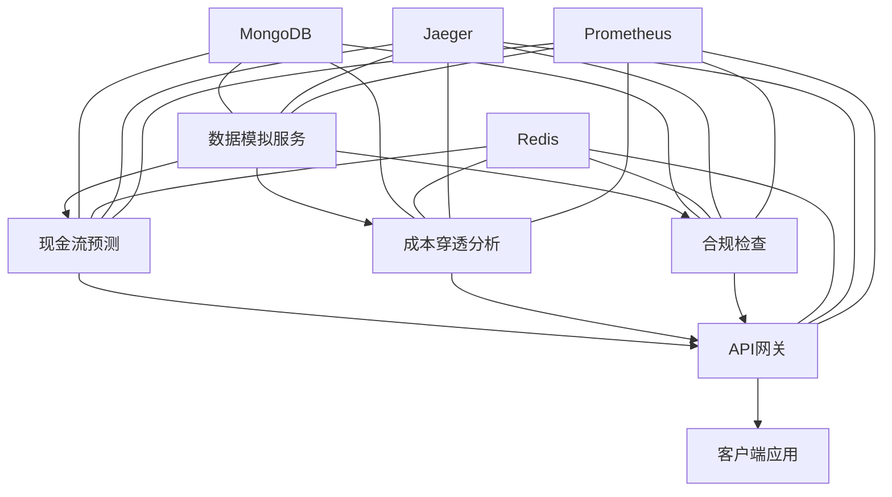

# 商户智能分析平台集成文档

## 系统架构

商户智能分析平台采用微服务架构，由以下组件构成：



## 服务通信协议

本系统采用双重协议模式：

1. **HTTP REST API**：面向外部客户端，提供标准化RESTful接口
   - 路径格式：`/api/v1/{service}/{resource}`
   - 认证方式：JWT Bearer Token
   - 内容类型：`application/json`

2. **gRPC**：面向内部服务间通信，提供高性能RPC调用
   - 服务定义：参见 `protos/merchant_analysis.proto`
   - 传输格式：Protocol Buffers
   - 服务发现：基于Consul

## 数据格式标准

### 请求格式 (HTTP)

```json
{
  "merchant_id": "string",
  "time_range": {
    "start_date": "YYYY-MM-DD",
    "end_date": "YYYY-MM-DD"
  },
  "analysis_types": ["cashflow", "cost", "compliance"],
  "parameters": {
    "prediction_days": 30,
    "confidence_level": 0.95
  }
}
```

### 响应格式 (HTTP)

```json
{
  "request_id": "string",
  "results": [
    {
      "type": "cashflow",
      "data": { ... }
    }
  ],
  "status": {
    "code": 200,
    "message": "Success"
  }
}
```

### Proto定义 (gRPC)

所有服务间通信使用Protocol Buffers定义的消息格式，详见`protos/merchant_analysis.proto`。

## 错误码规范

| HTTP状态码 | 业务错误码 | 描述 |
|------------|------------|------|
| 400 | INVALID_REQUEST | 请求格式或参数错误 |
| 401 | UNAUTHORIZED | 未认证或认证失败 |
| 403 | PERMISSION_DENIED | 权限不足 |
| 404 | DATA_NOT_FOUND | 请求的数据不存在 |
| 500 | INTERNAL_ERROR | 服务内部错误 |
| 503 | SERVICE_UNAVAILABLE | 服务暂时不可用 |

## 身份认证与授权

系统采用JWT+RBAC模型进行认证授权：

1. 客户端通过`/api/v1/auth/token`获取JWT令牌
2. 所有请求需在Header中携带`Authorization: Bearer {token}`
3. 权限粒度控制到具体分析类型和商户ID
4. 令牌过期时间：24小时

## 监控与可观测性

系统集成了完整的可观测性体系：

1. **指标监控**：Prometheus + Grafana
   - 端点：`/metrics`
   - 仪表盘：商户分析平台监控

2. **链路追踪**：Jaeger
   - 端点：`http://jaeger:16686`
   - 采样率：100%（生产环境可调整）

3. **日志聚合**：集中式日志服务
   - 格式：JSON结构化
   - 字段标准：时间戳、服务名、请求ID、级别、消息

## 服务发现与注册

服务注册与发现基于Consul实现：

1. 服务启动时自动注册
2. 健康检查周期：30秒
3. 服务发现查询：`consul.service.{service_name}`

## 限流与熔断

1. **API网关限流**：基于Redis令牌桶算法
   - 默认限制：100请求/分钟/客户端
   - 可基于商户等级调整限制

2. **服务间熔断**：Circuit Breaker模式
   - 熔断阈值：50%错误率
   - 半开时间：30秒
   - 最大重试：3次

## 部署指南

### 开发环境

```bash
# 启动所有服务
make dev

# 只启动特定服务
docker-compose up api_gateway data_simulator
```

### 生产环境

```bash
# 构建并启动
make build run

# 健康检查
make check-health
```

### 环境变量配置

必要的环境变量：

- `MONGODB_URI`: MongoDB连接字符串
- `REDIS_URI`: Redis连接字符串
- `JWT_SECRET`: JWT签名密钥
- `ENVIRONMENT`: 环境名称(dev/test/prod)

## 集成测试

运行完整测试：

```bash
make test
``` 