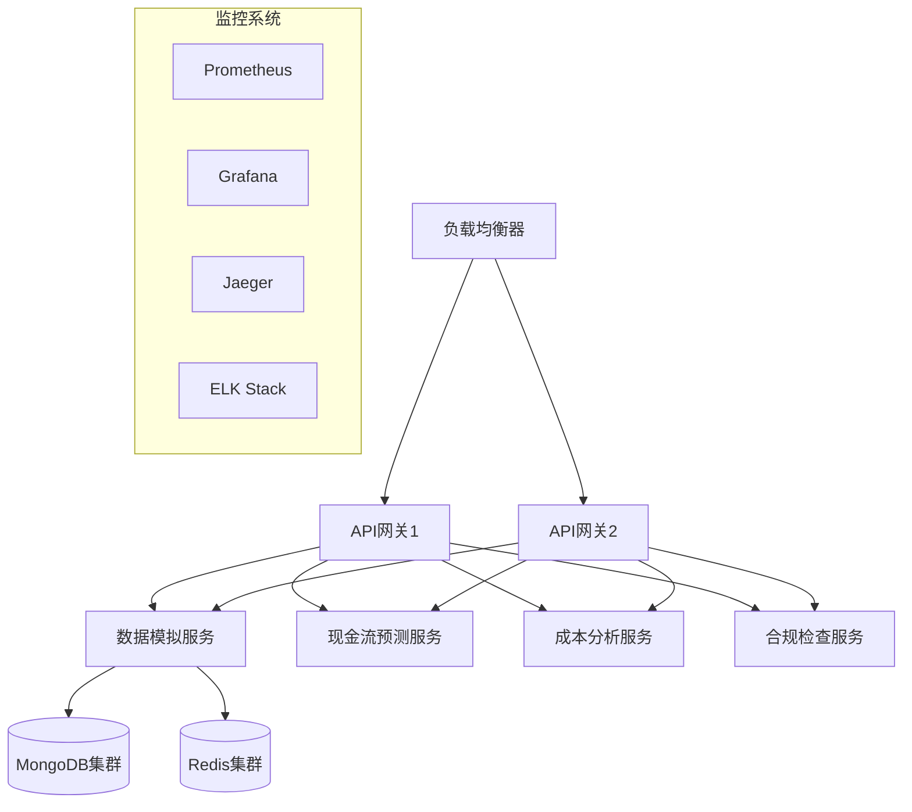

# 商户智能经营分析平台部署指南

## 环境要求

### 硬件要求
- CPU: 8核心以上
- 内存: 16GB以上
- 磁盘: 100GB以上（SSD推荐）
- 网络: 千兆网络

### 软件要求
- Docker Engine 20.10+
- Docker Compose 2.0+
- Git
- Python 3.9+（仅开发环境需要）

## 部署架构

### 生产环境架构


## 部署步骤

### 1. 准备工作

#### 1.1 克隆代码仓库
```bash
git clone https://github.com/your-org/merchant-analysis.git
cd merchant-analysis
```

#### 1.2 配置环境变量
创建生产环境配置文件 `.env.prod`：

```env
# 环境配置
ENVIRONMENT=production
LOG_LEVEL=INFO

# MongoDB配置
MONGODB_URI=mongodb://mongodb-cluster:27017/merchant_analysis
MONGODB_REPLICA_SET=rs0
MONGODB_USERNAME=admin
MONGODB_PASSWORD=secure-password

# Redis配置
REDIS_URI=redis://redis-cluster:6379/0
REDIS_PASSWORD=secure-password

# JWT配置
JWT_SECRET=your-production-secret
JWT_ALGORITHM=HS256
JWT_EXPIRES_IN=3600

# 服务发现
CONSUL_HOST=consul
CONSUL_PORT=8500

# 监控配置
PROMETHEUS_PUSHGATEWAY=http://pushgateway:9091
JAEGER_AGENT_HOST=jaeger
JAEGER_AGENT_PORT=6831

# 日志配置
ELASTICSEARCH_HOSTS=["http://elasticsearch:9200"]
KIBANA_HOST=http://kibana:5601
```

### 2. 数据库部署

#### 2.1 MongoDB集群
```yaml
# docker-compose.mongodb.yml
version: '3.8'

services:
  mongodb-1:
    image: mongo:5.0
    command: ["--replSet", "rs0", "--bind_ip_all"]
    volumes:
      - mongodb_data_1:/data/db
    networks:
      - db_network

  mongodb-2:
    image: mongo:5.0
    command: ["--replSet", "rs0", "--bind_ip_all"]
    volumes:
      - mongodb_data_2:/data/db
    networks:
      - db_network

  mongodb-3:
    image: mongo:5.0
    command: ["--replSet", "rs0", "--bind_ip_all"]
    volumes:
      - mongodb_data_3:/data/db
    networks:
      - db_network

volumes:
  mongodb_data_1:
  mongodb_data_2:
  mongodb_data_3:

networks:
  db_network:
    driver: overlay
```

#### 2.2 Redis集群
```yaml
# docker-compose.redis.yml
version: '3.8'

services:
  redis-master:
    image: redis:6.2
    command: redis-server --requirepass ${REDIS_PASSWORD}
    volumes:
      - redis_data:/data
    networks:
      - cache_network

  redis-replica-1:
    image: redis:6.2
    command: redis-server --slaveof redis-master 6379 --requirepass ${REDIS_PASSWORD}
    networks:
      - cache_network

  redis-replica-2:
    image: redis:6.2
    command: redis-server --slaveof redis-master 6379 --requirepass ${REDIS_PASSWORD}
    networks:
      - cache_network

volumes:
  redis_data:

networks:
  cache_network:
    driver: overlay
```

### 3. 监控系统部署

#### 3.1 Prometheus + Grafana
```yaml
# docker-compose.monitoring.yml
version: '3.8'

services:
  prometheus:
    image: prom/prometheus:v2.33.0
    volumes:
      - ./config/prometheus.yml:/etc/prometheus/prometheus.yml
      - prometheus_data:/prometheus
    networks:
      - monitoring_network

  grafana:
    image: grafana/grafana:8.3.3
    volumes:
      - ./config/grafana/provisioning:/etc/grafana/provisioning
      - grafana_data:/var/lib/grafana
    networks:
      - monitoring_network

  alertmanager:
    image: prom/alertmanager:v0.23.0
    volumes:
      - ./config/alertmanager.yml:/etc/alertmanager/alertmanager.yml
    networks:
      - monitoring_network

volumes:
  prometheus_data:
  grafana_data:

networks:
  monitoring_network:
    driver: overlay
```

#### 3.2 ELK Stack
```yaml
# docker-compose.elk.yml
version: '3.8'

services:
  elasticsearch:
    image: docker.elastic.co/elasticsearch/elasticsearch:7.16.2
    environment:
      - discovery.type=single-node
    volumes:
      - elasticsearch_data:/usr/share/elasticsearch/data
    networks:
      - elk_network

  logstash:
    image: docker.elastic.co/logstash/logstash:7.16.2
    volumes:
      - ./config/logstash/pipeline:/usr/share/logstash/pipeline
    networks:
      - elk_network

  kibana:
    image: docker.elastic.co/kibana/kibana:7.16.2
    networks:
      - elk_network

volumes:
  elasticsearch_data:

networks:
  elk_network:
    driver: overlay
```

### 4. 应用服务部署

```yaml
# docker-compose.prod.yml
version: '3.8'

services:
  api_gateway:
    image: merchant-analysis/api-gateway:${VERSION}
    deploy:
      replicas: 2
      update_config:
        parallelism: 1
        delay: 10s
      restart_policy:
        condition: on-failure
    env_file: .env.prod
    networks:
      - app_network

  data_simulator:
    image: merchant-analysis/data-simulator:${VERSION}
    deploy:
      replicas: 2
    env_file: .env.prod
    networks:
      - app_network

  cashflow_predictor:
    image: merchant-analysis/cashflow:${VERSION}
    deploy:
      replicas: 2
    env_file: .env.prod
    networks:
      - app_network

  cost_analyzer:
    image: merchant-analysis/cost-analyzer:${VERSION}
    deploy:
      replicas: 2
    env_file: .env.prod
    networks:
      - app_network

  compliance_checker:
    image: merchant-analysis/compliance:${VERSION}
    deploy:
      replicas: 2
    env_file: .env.prod
    networks:
      - app_network

networks:
  app_network:
    driver: overlay
```

### 5. 部署命令

```bash
# 1. 部署数据库
docker-compose -f docker-compose.mongodb.yml up -d
docker-compose -f docker-compose.redis.yml up -d

# 2. 部署监控系统
docker-compose -f docker-compose.monitoring.yml up -d
docker-compose -f docker-compose.elk.yml up -d

# 3. 部署应用服务
export VERSION=1.0.0
docker-compose -f docker-compose.prod.yml up -d
```

## 部署后配置

### 1. 初始化MongoDB副本集
```javascript
rs.initiate({
  _id: "rs0",
  members: [
    { _id: 0, host: "mongodb-1:27017" },
    { _id: 1, host: "mongodb-2:27017" },
    { _id: 2, host: "mongodb-3:27017" }
  ]
})
```

### 2. 配置Grafana数据源
1. 访问Grafana UI（http://your-host:3000）
2. 添加Prometheus数据源
3. 导入预配置的仪表板

### 3. 配置告警规则
1. 在Prometheus中配置告警规则
2. 设置AlertManager通知渠道
3. 测试告警触发

### 4. 配置日志收集
1. 配置Logstash管道
2. 创建Elasticsearch索引
3. 设置Kibana可视化

## 验证部署

### 1. 健康检查
```bash
# 检查API网关
curl http://your-host:8000/health

# 检查各个服务
curl http://your-host:8000/services/health
```

### 2. 负载测试
```bash
# 使用ab进行压力测试
ab -n 1000 -c 100 http://your-host:8000/merchant/analyze
```

### 3. 监控检查
1. 查看Grafana仪表板
2. 检查Prometheus指标
3. 验证日志收集

## 备份策略

### 1. 数据库备份
```bash
# MongoDB备份
mongodump --uri="mongodb://mongodb-cluster:27017" --out=/backup/mongodb/$(date +%Y%m%d)

# Redis备份
redis-cli -h redis-master save
```

### 2. 配置备份
```bash
# 备份配置文件
tar -czf /backup/config/$(date +%Y%m%d).tar.gz ./config/
```

## 故障恢复

### 1. 服务故障
```bash
# 重启服务
docker-compose -f docker-compose.prod.yml restart api_gateway

# 查看日志
docker-compose -f docker-compose.prod.yml logs api_gateway
```

### 2. 数据库故障
```bash
# MongoDB恢复
mongorestore --uri="mongodb://mongodb-cluster:27017" /backup/mongodb/latest/

# Redis恢复
redis-cli -h redis-master FLUSHALL
redis-cli -h redis-master RESTORE
```

## 扩容指南

### 1. 扩展服务实例
```bash
# 扩展API网关
docker-compose -f docker-compose.prod.yml up -d --scale api_gateway=4

# 扩展分析服务
docker-compose -f docker-compose.prod.yml up -d --scale cashflow_predictor=4
```

### 2. 扩展数据库
- 添加MongoDB分片
- 扩展Redis集群
- 调整资源配置

## 维护计划

### 1. 定期维护
- 每周日凌晨2:00-4:00进行例行维护
- 每月第一个周日进行版本更新
- 每季度进行一次全面系统检查

### 2. 监控指标
- CPU使用率 < 70%
- 内存使用率 < 80%
- 服务响应时间 < 500ms
- 错误率 < 0.1%

### 3. 应急预案
- 建立应急响应团队
- 准备回滚方案
- 保持备份最新
- 定期演练 