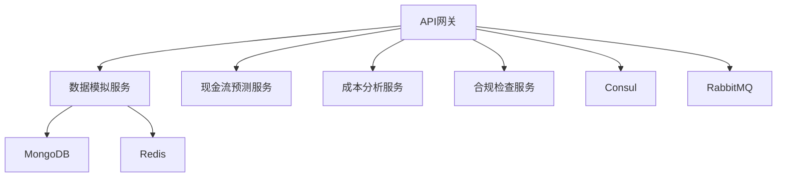

# 商户智能经营分析平台开发指南

## 项目概述

商户智能经营分析平台是一个基于微服务架构的分布式系统，旨在为商户提供全方位的经营分析服务。本指南将帮助开发者快速理解系统架构并开始开发工作。

## 技术栈

### 后端服务
- 语言：Python 3.9+
- Web框架：FastAPI
- 数据库：MongoDB
- 缓存：Redis
- 消息队列：RabbitMQ
- 服务发现：Consul
- 监控：Prometheus + Grafana
- 链路追踪：Jaeger
- 日志收集：ELK Stack

### 开发工具
- 代码版本控制：Git
- 容器化：Docker + Docker Compose
- API文档：OpenAPI 3.0
- 测试框架：pytest
- 代码质量：pylint, black, mypy

## 系统架构

### 服务组件


### 目录结构
```
merchant-analysis/
├── services/
│   ├── api_gateway/        # API网关服务
│   ├── data_simulator/     # 数据模拟服务
│   ├── cashflow/          # 现金流预测服务
│   ├── cost_analyzer/     # 成本分析服务
│   ├── compliance/        # 合规检查服务
│   └── shared/            # 共享库
├── tests/                 # 测试代码
├── docs/                  # 文档
├── config/               # 配置文件
└── docker/              # Docker相关文件
```

## 开发环境搭建

### 1. 安装依赖

```bash
# 安装Python依赖
pip install -r requirements.txt

# 安装开发工具
pip install -r requirements-dev.txt
```

### 2. 启动基础服务

```bash
# 启动开发环境
docker-compose -f docker-compose.dev.yml up -d
```

### 3. 配置环境变量

创建 `.env` 文件：

```env
# 服务配置
ENVIRONMENT=development
LOG_LEVEL=DEBUG

# MongoDB配置
MONGODB_URI=mongodb://localhost:27017/merchant_analysis

# Redis配置
REDIS_URI=redis://localhost:6379/0

# JWT配置
JWT_SECRET=your-secret-key
JWT_ALGORITHM=HS256
JWT_EXPIRES_IN=3600

# 服务发现
CONSUL_HOST=localhost
CONSUL_PORT=8500
```

## 开发规范

### 1. 代码风格

- 使用Black进行代码格式化
- 遵循PEP 8规范
- 使用类型注解
- 编写完整的文档字符串

示例：
```python
from typing import Optional, Dict, Any

def process_data(data: Dict[str, Any], options: Optional[Dict[str, str]] = None) -> bool:
    """处理数据
    
    Args:
        data: 待处理的数据
        options: 处理选项
        
    Returns:
        bool: 处理是否成功
    """
    pass
```

### 2. 错误处理

- 使用标准化的错误类型
- 实现完整的错误追踪
- 提供有意义的错误消息

示例：
```python
from shared.errors import ServiceError, ValidationError

try:
    result = process_data(data)
except ValidationError as e:
    logger.error(f"数据验证失败: {e}")
    raise
except ServiceError as e:
    logger.error(f"服务错误: {e}")
    raise
```

### 3. 测试规范

- 单元测试覆盖率要求 > 80%
- 编写集成测试
- 使用测试夹具和工厂

示例：
```python
import pytest
from unittest.mock import Mock

@pytest.fixture
def mock_service():
    return Mock()

def test_process_data(mock_service):
    result = process_data({"test": "data"}, mock_service)
    assert result is True
    mock_service.validate.assert_called_once()
```

### 4. API设计原则

- 遵循RESTful设计规范
- 使用标准的HTTP方法和状态码
- 实现版本控制
- 提供详细的API文档

### 5. 监控和日志

- 使用结构化日志格式
- 添加关键指标监控
- 实现分布式追踪
- 配置告警规则

## 部署流程

### 1. 构建镜像

```bash
# 构建所有服务
docker-compose build

# 构建单个服务
docker-compose build api_gateway
```

### 2. 测试部署

```bash
# 运行测试
pytest

# 运行特定测试
pytest tests/test_api_gateway.py
```

### 3. 生产部署

```bash
# 部署到生产环境
docker-compose -f docker-compose.prod.yml up -d
```

## 故障排查

### 1. 日志查看

```bash
# 查看服务日志
docker-compose logs api_gateway

# 实时查看日志
docker-compose logs -f api_gateway
```

### 2. 监控检查

- 访问Grafana面板：`http://localhost:3000`
- 查看Prometheus指标：`http://localhost:9090`
- 检查Jaeger追踪：`http://localhost:16686`

### 3. 健康检查

```bash
# 检查服务健康状态
curl http://localhost:8000/health

# 查看服务指标
curl http://localhost:8000/metrics
```

## 常见问题

### 1. 服务发现问题

- 检查Consul服务状态
- 验证服务注册信息
- 确认网络连接

### 2. 性能问题

- 检查数据库索引
- 优化查询语句
- 调整缓存策略
- 分析慢查询日志

### 3. 内存泄漏

- 使用内存分析工具
- 检查连接池配置
- 分析垃圾回收日志

## 参考资源

- [FastAPI文档](https://fastapi.tiangolo.com/)
- [MongoDB文档](https://docs.mongodb.com/)
- [Docker文档](https://docs.docker.com/)
- [Consul文档](https://www.consul.io/docs)
- [Prometheus文档](https://prometheus.io/docs/) 